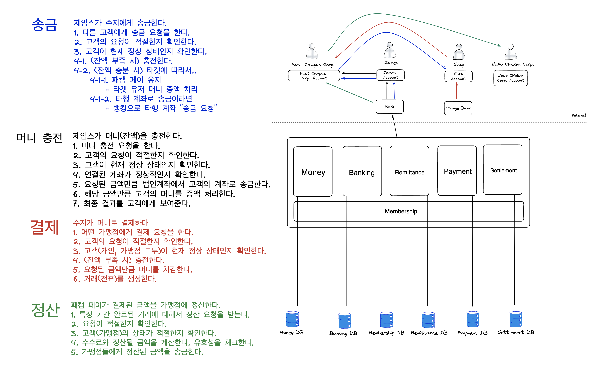
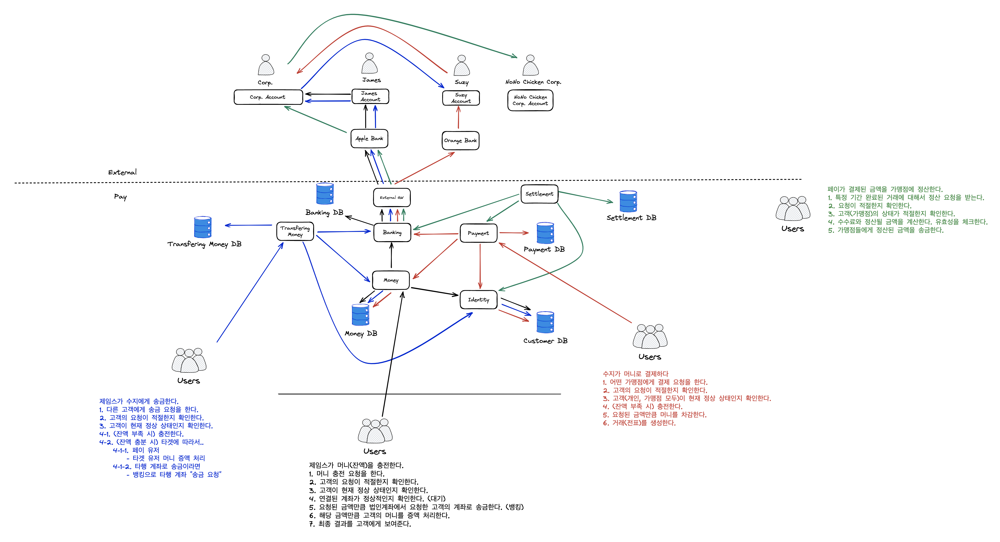
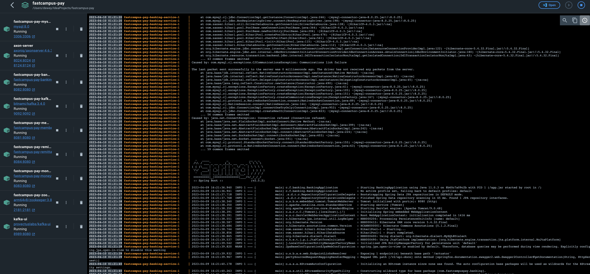
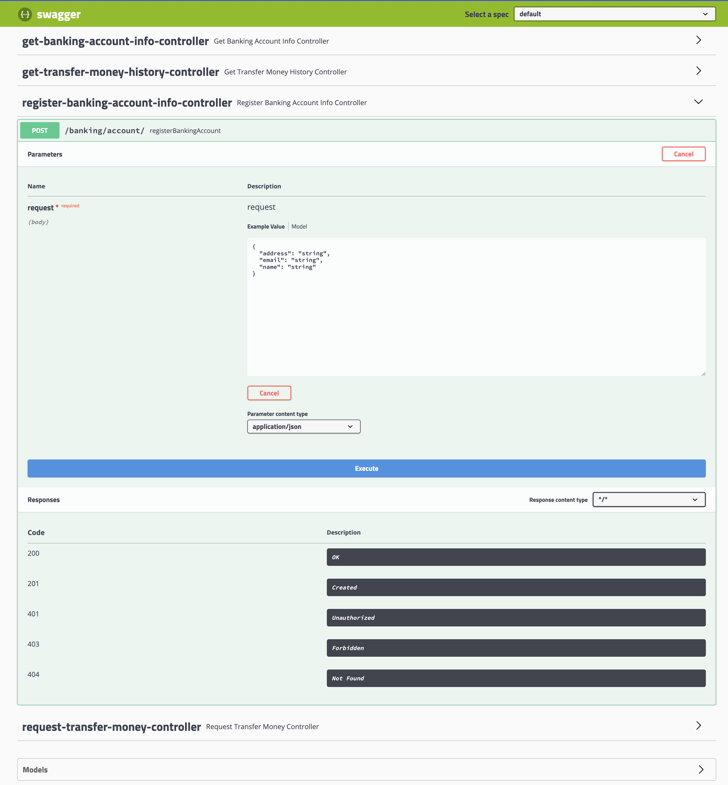
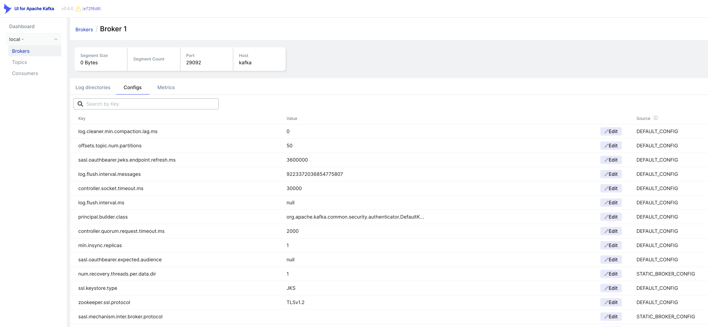
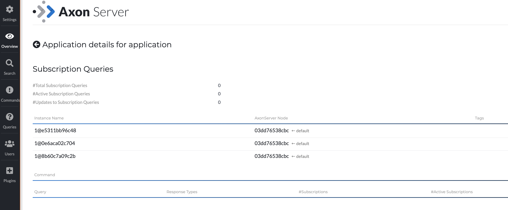
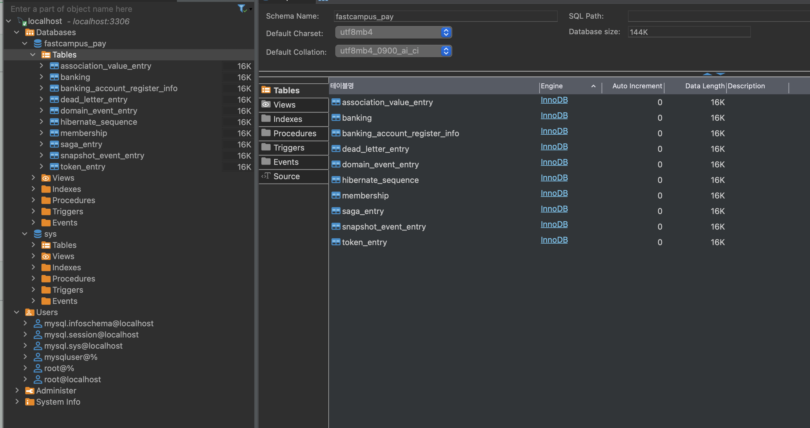

# Pay Project Overview


일반적인 간편결제 도메인을 주제로, MSA 를 중점적으로 학습하기 위한 프로젝트입니다.

회원(Membership), 뱅킹(Banking), 머니(Money), 송금(Remittance), 결제(Payment), 정산(Settlement) 6개의 서비스로 구성되어 있으며, 각각의 독립적인 프로젝트로 구성되어 있습니다.

## Overall Architecture for Monolithic System


## Overall Architecture for MSA


## Membership Service
고객의 회원 가입, 회원 정보 변경, 회원 정보 조회 등의 기능을 제공하는 서비스입니다.


### API Lists
- registerMembership
- updateMembershipByMemberId (CQRS Trigger)
- findMembershipByMemberId
- loginByMembershipIdPw
- authByToken

#### Using Stack
  - Spring Boot, Java 11, Spring Data JPA, H2, Mysql, Lombok, Gradle, JWT, Axon Framework, Docker, Docker Compose, AWS DynamoDB

### Sequence Diagram Example (회원 가입, JWT 토큰 인증 프로세스) 


## Banking Service 
고객의 계좌 정보 등록, 등록된 계좌 정보 조회, 입/출금, 거래내역 조회 등의 기능을 제공하는 서비스입니다.
  
### API Lists
- registerBankingAccount
- requestTransferMoneyToBank
- findRegisteredBankingAccountByMemberId
- findTransferMoneyInfoByMemberId
- findTransferMoneyInfoByBankingId

#### Using Stack
  - Spring Boot, Java 11, Spring Data JPA, H2, Mysql, Lombok, Gradle, JWT, Axon Framework, Docker, Docker Compose

### Sequence Diagram Example (입/출금 요청 프로세스)


## Money Service
고객의 충전 잔액(머니) CRUD, 충전 내역 조회 등의 기능을 제공하는 서비스입니다.
    
### API Lists
- rechargeMoneyByMemberId
- findMoneyInfoByRechargeMoneyId
- findMoneyHistoryByMemberId
- transferMoneyBetweenMembers

### MoneyLocal Service (for CQRS)
- calculateMoneySumByLocal 
- MembershipUpdate (EventHandler)

#### Using Stack
- Spring Boot, Java 11, Spring Data JPA, H2, Mysql, Lombok, Gradle, JWT, Axon Framework, Docker, Docker Compose, Kafka, Kafka-ui, Zookeeper, AWS DynamoDB

### Sequence Diagram Example (충전 잔액(머니) 충전 프로세스)


## Remittance Service
고객 간 송금 기능 및 송금 내역 정보 조회 등의 기능을 제공하는 서비스입니다.


### API Lists
- requestRemittance
- findRemittanceInfoByRemittanceId
- findRemittanceHistoryByMemberId
- findMoneyTransferringByRemittanceId (API Aggregation, Banking + Money)

#### Using Stack
- Spring Boot, Java 11, Spring Data JPA, H2, Mysql, Lombok, Gradle, JWT, Axon Framework, Docker, Docker Compose, AWS DynamoDB

### Sequence Diagram Example (송금 프로세스)


## Payment Service
가맹점에서 Fastcampus Pay 를 이용한 간편 결제 및 결제 내역 조회 등의 기능을 제공하는 서비스입니다. 


### API Lists
- requestPaymentAtMerchant
- findPaymentByPaymentId
- listPaymentsByPeriod

#### Using Stack
- Spring Boot, Java 11, Spring Data JPA,  Mysql, Lombok, Gradle, Axon Framework, Docker, Docker Compose

### Sequence Diagram Example (결제 프로세스)


## Settlement Service (Part. 6)
완료된 결제 내역을 기준으로 가맹점에 정산된 금액을 입금하고, 수수료 수취를 위한 기능을 제공하는 서비스입니다.

### API Lists
- startSettlementByPeriod 

#### Using Stack
- Spring Boot, Java 11, Spring Data JPA, Mysql, Lombok, Gradle, JWT, Axon Framework, Docker, Docker Compose
 
### Sequence Diagram Example (정산 프로세스)


## Execution
```
./gradlew docker
docker-compose up -d
```

## Service Endpoint & Swagger UI
- Membership Service
  - http://localhost:8081/membership/
  - http://localhost:8081/swagger-ui.html
- Banking Service
  - http://localhost:8082/banking/
  - http://localhost:8082/swagger-ui.html
- Money Service
  - http://localhost:8083/money/
  - http://localhost:8083/swagger-ui.html
- Money Local Service (CQRS View Service)
  - http://localhost:8084/money-local/
  - http://localhost:8084/swagger-ui.html
- Remittance Service
  - http://localhost:8085/remittance/
  - http://localhost:8085/swagger-ui.html
- Payment Service
  - http://localhost:8086/payment/
  - http://localhost:8086/swagger-ui.html
- Settlement Service
  - http://localhost:8087/settlement/
  - http://localhost:8087/swagger-ui.html
  
- Mysql
  - http://localhost:3306
  - root password: rootpassword
  - database: pay
  - User/PW : mysqluser / mysqlpw
- Kafka UI
  - http://localhost:8989
- Axon Server Dashboard
  - http://localhost:8024


## Trouble Shooting
### 1. gradle build(docker build) 시, dockerPrepare 단계에서 error 가 발생하는 경우 
```
./gradlew --stop
./gradlew docker
```

## Sample Screenshots









