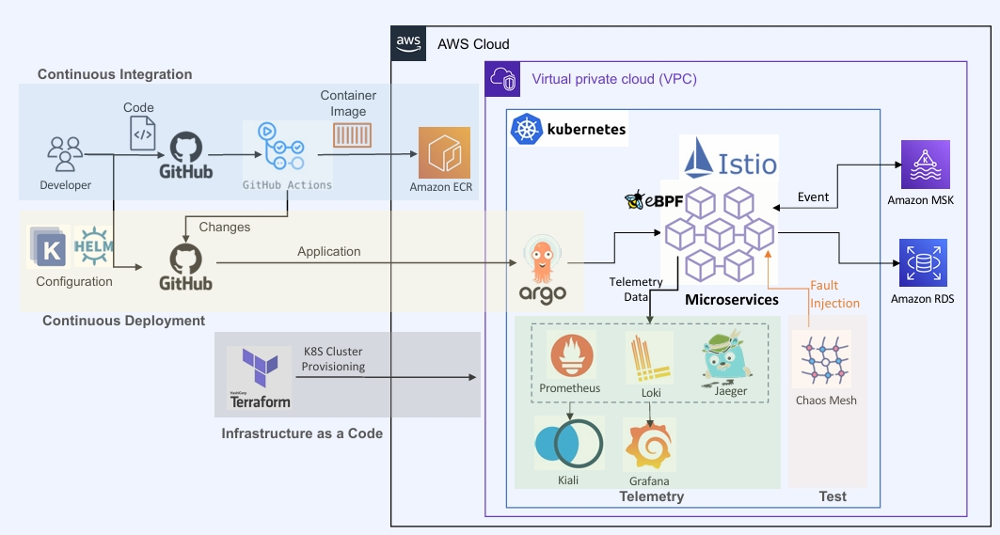

# Pay Project Overview

일반적인 간편결제 도메인을 주제로, MSA 를 중점적으로 만든 프로젝트입니다.

회원(Membership), 뱅킹(Banking), 머니(Money), 송금(Remittance), 결제(Payment), 정산(Settlement), 프랜차이즈(Franchise) 7개의 서비스로 구성되어 있으며, 각각의 독립적인 프로젝트로 구성되어 있습니다.

## Membership Service
고객의 회원 가입, 회원 정보 변경, 회원 정보 조회 등의 기능을 제공하는 서비스입니다.

### API Lists
- registerMembership
- registerMembershipEvent
- modifyMembership
- findMembership
- loginMemebership
- refreshJwtTokenByRefreshToken
- validateJwtToken
- getMembershipByJwtToken
#### Using Stack
  - Spring Boot, Java 11, Spring Data JPA, H2, Mysql, Lombok, Gradle, JWT, Axon Framework, Docker, Docker Compose, AWS DynamoDB, Vault

### Sequence Diagram Example (회원 가입, JWT 토큰 인증 프로세스) 

## Banking Service 
고객의 계좌 정보 등록, 등록된 계좌 정보 조회, 입/출금, 거래내역 조회 등의 기능을 제공하는 서비스입니다.
  
### API Lists
- findBankAccount
- findFirmbanking
- registerBankAccount
- registerBankAccountByEvent
- requestFirmbanking
- requestFirmbankingByEvent
#### Using Stack
  - Spring Boot, Java 11, Spring Data JPA, H2, Mysql, Lombok, Gradle, JWT, Axon Framework, Docker, Docker Compose, Vault

### Sequence Diagram Example (입/출금 요청 프로세스)

## Money Service
고객의 충전 잔액(머니) CRUD, 충전 내역 조회 등의 기능을 제공하는 서비스입니다.
    
### API Lists
- increaseMoneyRequest
- increaseMoneyRequestByEvent
- decreaseMoneyRequest
- decreaseMoneyRequestByEvent
- createMemberMoney
- getBalanceRequest

### money-query-service (for CQRS)
- queryMoneySumByRegion

#### Using Stack
- Spring Boot, Java 11, Spring Data JPA, H2, Mysql, Lombok, Gradle, JWT, Axon Framework, Docker, Docker Compose, Kafka, Kafka-ui, Zookeeper, AWS DynamoDB, Vault

### Sequence Diagram Example (충전 잔액(머니) 충전 프로세스)

## Remittance Service
고객 간 송금 기능 및 송금 내역 정보 조회 등의 기능을 제공하는 서비스입니다.

### API Lists
- requestRemittance
- findRemittanceHistory

#### Using Stack
- Spring Boot, Java 11, Spring Data JPA, H2, Mysql, Lombok, Gradle, JWT, Axon Framework, Docker, Docker Compose, AWS DynamoDB, Vault

### Sequence Diagram Example (송금 프로세스)

## Payment Service
가맹점에서 Pay 를 이용한 간편 결제 및 결제 내역 조회 등의 기능을 제공하는 서비스입니다. 

### API Lists
- requestPayment
- getNormalStatusPayments
- finishPayment

#### Using Stack
- Spring Boot, Java 11, Spring Data JPA,  Mysql, Lombok, Gradle, Axon Framework, Docker, Docker Compose, Vault

### Sequence Diagram Example (결제 프로세스)

## Settlement Service
완료된 결제 내역을 기준으로 가맹점에 정산된 금액을 입금하고, 수수료 수취를 위한 기능을 제공하는 서비스입니다.

#### Using Stack
- Spring Boot, Java 11, Spring Data JPA, Mysql, Lombok, Gradle, JWT, Axon Framework, Docker, Docker Compose, Vault
 
### Sequence Diagram Example (정산 프로세스)

# Infra Overview

## Continuous Integration
GitHub를 통해 코드를 관리하고, GitHub Actions를 사용하여 컨테이너 이미지를 생성한 후 Amazon ECR에 저장합니다. Helm을 통해 애플리케이션의 구성 변경 사항을 관리합니다.

## Continuous Deployment
Terraform을 통해 Kubernetes 클러스터를 프로비저닝하며, 인프라를 코드로 관리합니다.

## Infrastructure configuration

### AWS
- 전체 인프라는 AWS VPC 내에서 운영되며, Kubernetes가 컨테이너화된 마이크로서비스를 관리합니다.

### Istio
- 서비스 간의 통신을 관리하며, eBPF를 통해 성능 모니터링과 데이터 수집을 지원합니다.

### Monitoring and Testing
- 모니터링 및 테스트: Prometheus, Loki, Jaeger와 같은 도구를 사용해 텔레메트리 데이터를 수집하고, Kiali 및 Grafana를 통해 시각화합니다. 또한, Chaos Mesh를 이용해 장애 주입 테스트를 수행하여 시스템의 복원력을 검증합니다.

# 프로젝트에서 느낀 문제점

## 복잡한 서비스 관리
- MSA의 가장 큰 특징은 각 서비스가 독립적으로 운영된다는 점입니다. 그러나 이로 인해 서비스 간의 의존성을 관리하는 일이 매우 복잡해졌습니다. 각 서비스가 API를 통해 통신하기 때문에, 서비스 간의 호출 실패나 응답 지연이 전체 시스템에 영향을 미칠 수 있었습니다. 특히, 서비스가 서로 의존하고 있을 때 오류가 발생하면 원인을 찾기 어려워 시간이 많이 소요되었습니다. 디버깅 과정에서 로그를 추적하고, 어떤 서비스가 문제를 일으켰는지를 파악하는 데 많은 노력이 필요했습니다.

## 데이터 일관성 문제
- MSA를 구현하면서 각 서비스가 독립적인 데이터베이스를 가지게 되었습니다. 이로 인해 데이터 일관성을 유지하는 것이 큰 도전이었습니다. 특히, 여러 서비스에 걸친 트랜잭션을 처리해야 할 때, 데이터 정합성을 보장하는 것이 어렵다는 것을 체감했습니다. 예를 들어, 주문 서비스와 결제 서비스가 있을 때, 주문이 성공적으로 생성되었지만 결제가 실패하는 경우 데이터 불일치가 발생할 수 있었습니다. 이를 해결하기 위해 이벤트 소싱이나 CQRS와 같은 복잡한 패턴을 도입해야 했지만, 이는 또 다른 학습 곡선을 요구했습니다.

## 배포 관리의 어려움
- MSA에서는 각 서비스가 독립적으로 배포되기 때문에, 전체 시스템의 배포를 조율하는 것이 복잡해졌습니다. 배포 시 여러 서비스의 버전 호환성을 고려해야 하며, 이를 위해서 CI/CD 파이프라인을 설정하는 데 많은 시간이 소요되었습니다. 특히, 새로운 기능을 배포할 때, 이전 버전과의 호환성 문제로 인해 배포 후 문제가 발생하는 경우가 많았습니다. 이로 인해 롤백이나 핫픽스가 필요할 때 추가적인 작업이 발생했습니다.

## 모니터링 및 로깅의 필요성
- 여러 서비스가 독립적으로 운영되면서, 각 서비스의 상태를 모니터링하고 문제를 추적하기 위해 추가적인 모니터링 도구와 로깅 시스템을 구축해야 했습니다. 서비스가 많아질수록 로그의 양이 방대해졌고, 이를 중앙에서 관리하고 분석하는 것이 어려워졌습니다. 따라서, ELK 스택이나 Prometheus와 같은 도구를 도입해야 했고, 이로 인해 인프라 관리가 복잡해졌습니다. 문제가 발생했을 때, 어떤 서비스에서 문제가 발생했는지를 빠르게 찾는 것이 쉽지 않았습니다.

## 비용 문제
- MSA를 구현하면서 클라우드 서비스나 인프라 비용이 증가할 수 있다는 점도 문제로 느꼈습니다. 여러 개의 서비스가 독립적으로 운영되면서 리소스 사용이 비효율적일 수 있었습니다. 예를 들어, 각 서비스마다 별도의 인스턴스를 운영하게 되면 비용이 급증할 수 있으며, 불필요한 리소스 낭비가 발생할 수 있습니다. 이를 관리하기 위해 비용 최적화 방안을 고민해야 했습니다.

## 결론
- 이 프로젝트를 통해 MSA(마이크로서비스 아키텍처)의 매력과 도전 과제를 동시에 경험하게 되었습니다. 처음에는 MSA가 제공하는 유연성과 확장성에 큰 기대를 했습니다. 각 서비스가 독립적으로 운영되면서 새로운 기능을 손쉽게 추가할 수 있다는 점은 정말 매력적이었죠. 그런데 실상 진행해 보니, 그 이면에 숨어 있는 복잡성과 관리의 어려움이 만만치 않았습니다.

특히, 서비스 간의 의존성을 관리하고 데이터 일관성을 유지하는 데 정말 많은 고민이 필요했습니다. 처음에는 작은 규모의 프로젝트라서 괜찮겠지 했지만, 점점 서비스가 늘어나면서 그 복잡함이 기하급수적으로 증가했습니다. 이 과정에서 여러 가지 기술 스택과 패턴을 배우는 것도 쉽지 않았습니다. 새로운 것을 배우는 건 항상 흥미롭지만, 그로 인해 프로젝트의 진행 속도가 느려지는 건 또 다른 문제였죠.

이번 프로젝트에서는 프론트엔드가 부재한 상황에서 모든 테스트를 Swagger를 통해 진행했습니다. Swagger는 API 문서화와 테스트에 정말 유용했지만, 프론트엔드와의 협업이 없어서 아쉬운 점이 많았습니다. API를 테스트하는 과정에서 실제 사용자 경험을 고려한 피드백이 부족했거든요. 앞으로는 프론트엔드 개발자와 함께 협업하여 사용자 인터페이스와 API가 잘 연결될 수 있도록 작업하고 싶습니다. 이렇게 하면 더 완성도 높은 제품을 만들어 갈 수 있을 것이라고 믿습니다.

또한, 팀워크와 협업의 중요성을 절실히 느꼈습니다. 개인 프로젝트이긴 했지만, 여러 서비스의 조정을 혼자서 하다 보니 때때로 혼란스러웠습니다. 협업이 잘 이루어졌다면 훨씬 더 효율적이고 빠르게 진행할 수 있었을 것 같아요. 그래서 앞으로는 팀 프로젝트를 통해 MSA의 진정한 장점을 더 깊이 있게 경험해보고 싶습니다.

마지막으로, 비용 문제도 간과할 수 없겠더라고요. 클라우드 서비스의 요금이 생각보다 빠르게 증가하는 걸 보면서, 리소스를 어떻게 효율적으로 관리할지를 고민하게 되었습니다. 앞으로는 비용 최적화에 대한 전략도 함께 고려해야 할 것 같습니다.

결국, 이번 경험을 통해 MSA에 대한 이해가 깊어졌고, 그 과정에서 많은 것을 배웠습니다. 물론 어려움도 많았지만, 이런 도전이 있었기에 더 성장할 수 있었던 것 같습니다. 앞으로의 프로젝트에서는 이번 경험을 바탕으로 더 나은 선택을 할 수 있을 거라고 믿어요. MSA의 매력을 느끼면서도 그 한계를 이해하게 된 것이 정말 중요한 배움이었습니다.

이런 생각들을 정리하면서, 앞으로도 계속해서 새로운 도전을 해 나가고 싶다는 마음이 듭니다. MSA가 제공하는 많은 가능성을 탐구하며, 더욱 풍부한 경험을 쌓아가고 싶습니다.